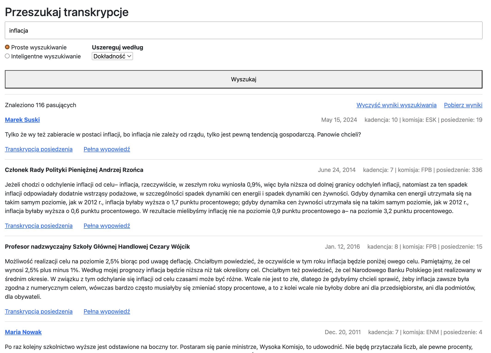
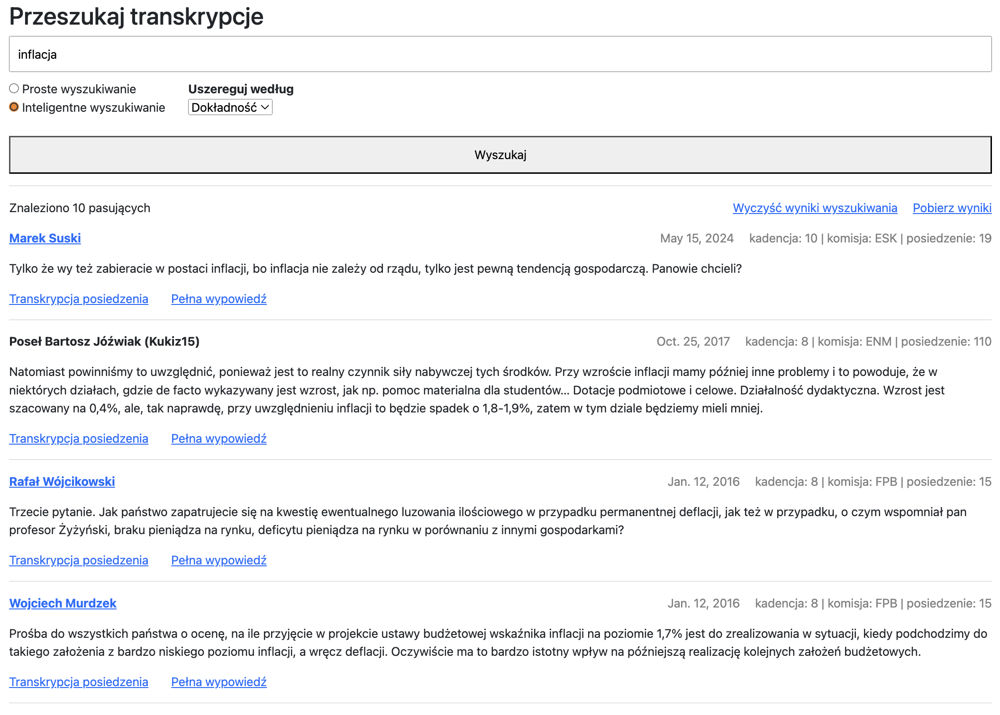

# SejmSearch

## Motivation

Much of politics is now carefully managed and spun by communication and PR experts. The modern media landscape, too, rarely encourages a substantive debate "about the issues". The app is intended to give you the ability to look behind the curtain of political discourse. Parliamentary committee sittings, with some exceptions, are usually not highly publicised and yet they are where much of crucial legislative work takes place. You may be interested in what your representatives have to say if you are:

- an academic studying political discourse
- a journalist
- an activist or NGO employee
- a lobbyist
- an interested citizen

## Functionalities

### Data collection and processing

- The repository does not contain any data from committee sittings but it does include code necessary to download and parse transcripts from the Polish parliament's (Sejm) public API. Keep in mind that there are ~17,000 committee sittings available via the Sejm API -- downloading and processing them will take some time. The API most likely will not let you download all the data at once.
- All transcripts are split into "paragraphs" (chunks of longer statements made by MPs) which can be viewed as our basic unit of analysis. Every paragraph and every statement is assigned to a specific MP.
- The app also gives you the means to vectorize paragraphs and perform vector searches. Again, if you intend to download and process the data yourself, keep in mind that this is a computationally intensive and long process.
- In fact, the code for data processing constitutes the main value added of the application. Original transcripts were provided in the html format, or, to be more precise, an 'html-inspired' format which made matching speakers to statements relatively challenging. I expect some parsing and attribution errors but they should be a rare occurence.

### Search

- App uses elasticsearch to search through transcripts. You can use 'naive' search to find keywords or vectorized search to look for 'topics' or 'sentiments' in the data.
- Examples:
    
Search based on a keyword:

    
Smart (vectorized) search:

### Tech stack

Python
Django
SQLite
Elasticsearch

### App setup

- All the data is stored both in an elasticsearch index and a relational database (currently: SQLite)
- The app contains several management commands for downloading, processing and vectorizing the data.
- Should you try to recreate all the data from Sejm's API and make it searchable you would need to use the following commands:

    - grouped under data_create
        - terms_create
        - mps_get
        - mps_create
        - terms_and_mps_link
        - committees_get
        - committees_create
        - terms_committees_and_members_link
        - sittings_create

    - remaining commands
        - transcripts_create
        - transcripts_process
        - paragraphs_vectorize

